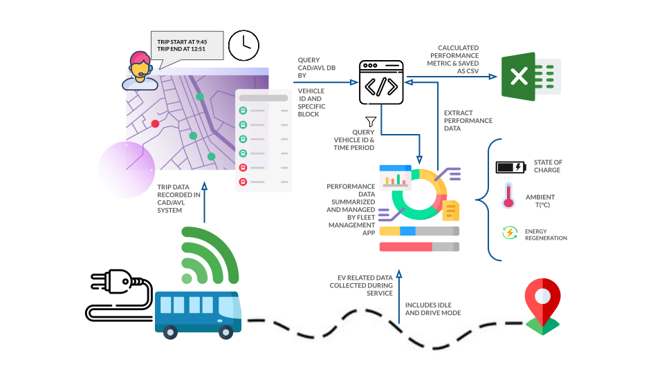

# About
The Python-based ETL pipeline is scheduled to run daily at 9:00 AM through the Windows Task Scheduler. Its primary objective is to fetch vendor data regarding electric vehicle performance and conduct calculations to update an engineer's Excel tracking sheet. This pipeline was developed to seamlessly integrate with existing systems like the vehicle dispatch system (CAD/AVL) via Oracle Database. By leveraging trip start-end time data, it accurately computes performance metrics within trip timeframes.

# Key Features
- **Interaction with CAD/AVL System**: The pipeline interacts with the CAD/AVL system via Oracle, specifically querying electric vehicles (EVs) in service for the day. The retrieved dataframe, containing start-end times for trips/service blocks, is utilized to extract vendor data for the day, eliminating the need for manual communication regarding vehicle service departures.
- **Data Extraction**: CAD/AVL data is utilized to extract vendor-collected EV data. This involves querying for each vehicle and providing start-end times to evaluate performance exclusively during service.
Output to Performance Tracking Sheet: The pipeline generates a CSV file utilizing vendor data to compile specific metrics tracked by the engineer. These metrics are instrumental in reporting on the performance of EVs in service.

Due to the absence of explicit APIs, the pipeline employs web scraping techniques to interact with the UI and internal APIs for data retrieval. This automation streamlines a labor-intensive process previously managed by a team of three individuals. Specifically, two engineers manually filtered route data based on dispatch personnel reports and recorded the data into an Excel spreadsheet.

The metrics collected from the vendor encompass temperature, state of charge, odometer reading, energy consumption, idling time, charging, driving duration, regeneration rate, charging events, and vehicle speed. 

# Technology
| **Category**                | Technologies                                                               |
|-----------------------------|---------------------------------------------------------------------------------------|
| **Programming & Data Processing** | Python, Pandas                                                |
| **Data Integration & Storage**    | Oracle Database, CSV files                     |
| **Automation & Scheduling**       | Windows Task Scheduler                                                          |
| **Data Retrieval**                | Web Scraping (UI and internal API interaction)                                   |

