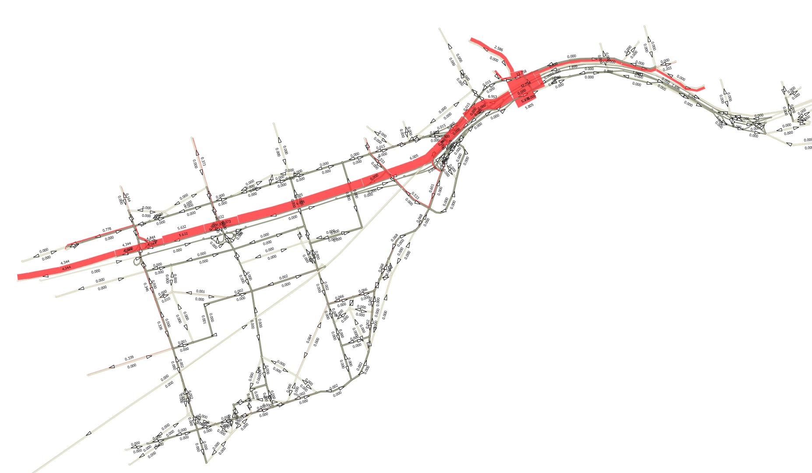

A Python script using multimodal Transport Planning Software EMME Desktop API to automate select-link analysis for multiple origin-destination pairs determining traffic volume routing contribution for selected road segments in the road network (E.g., how many vehicles going from Zone A to G use Corridor P or a portion of Corridor P defined between node 9105 and 9062 ). 

Results were summarized in a csv table and presented in ArcGIS/QGIS for visualization.
Diagram illustrates the concept followed by a sample result.

*EMME Result*