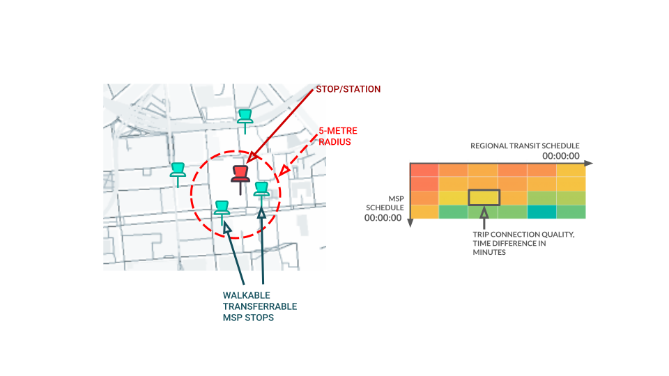
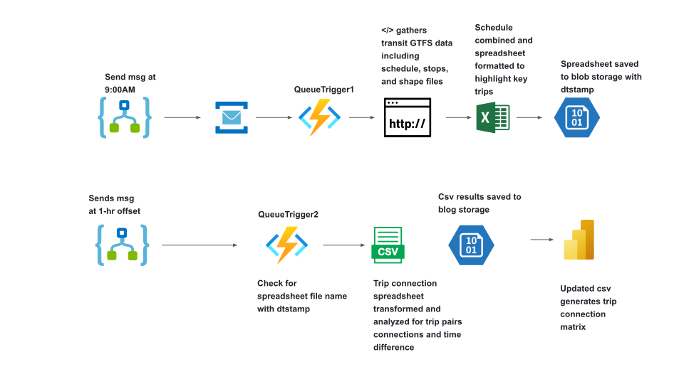

## About
The project revolves around an existing Python codebase hosted on Bitbucket, utilizing Azure Functions infrastructure to streamline trip connection analysis. The primary objective is to assess the quality of regional transit trip connections, particularly focusing on transferable municipal public transit routes (MSP). This involves fixing existing analysis inaccuracies, enhancing functionalities, and introducing a new feature to evaluate trip connection quality based on departure and arrival times.

## Key Components:
- **Azure Functions Integration**: Leveraging Azure Functions infrastructure, the codebase executes daily at 9:00 AM to gather MSP trips and perform comprehensive trip connection analysis.
- **Data Processing and Excel Output**: The function generates Excel outputs containing detailed trip connection analysis results. These outputs serve as inputs for subsequent visualization processes.
- **Power BI Visualization**: The Excel outputs are seamlessly integrated into Power BI for comprehensive data visualization. This facilitates the creation of insightful data visualizations to interpret trip connection metrics effectively.
- **New Feature Development**: As part of project inheritance, I rectified existing analysis inaccuracies and introduced a new feature to evaluate the quality of regional transit trip connections. This feature focuses on assessing the effectiveness of MSP routes based on departure and arrival times.
- **Dashboard Prototyping**: To enhance user experience and facilitate data interpretation, I prototyped a dashboard visual. The dashboard summarizes trip connection quality using a heatmap matrix, providing users with a holistic view of trip quality across the timetable schedule. This aids in optimizing regional transit timetables to better accommodate transfers to and from MSP transit.

The project addresses critical inaccuracies in trip connection analysis, ensuring the reliability and accuracy of transit data. Introduction of the new feature enhances the functionality of the codebase, providing users with valuable insights into MSP route effectiveness. The dashboard prototype significantly improves user experience by presenting trip connection quality in an intuitive and visually appealing manner.

As an inheritor of the project, my responsibilities included rectifying existing analysis inaccuracies, developing and integrating the new feature, and prototyping the dashboard visual. I collaborated closely with stakeholders to ensure the project met their requirements and delivered actionable insights for transit optimization.

# Technology
| Category            | Technologies                                                                 |
|---------------------|------------------------------------------------------------------------------|
| **Data Visualization**       | Power BI                                      |
| **Data Processing & Analysis**        | Python, Pandas |
| **Storage**       | Azure Blog Storage                                               |
| **Deployment & DevOps** | Azure Web Apps, Azure Functions, Azure Storage Queue, Azure Logic App, Bitbucket|
