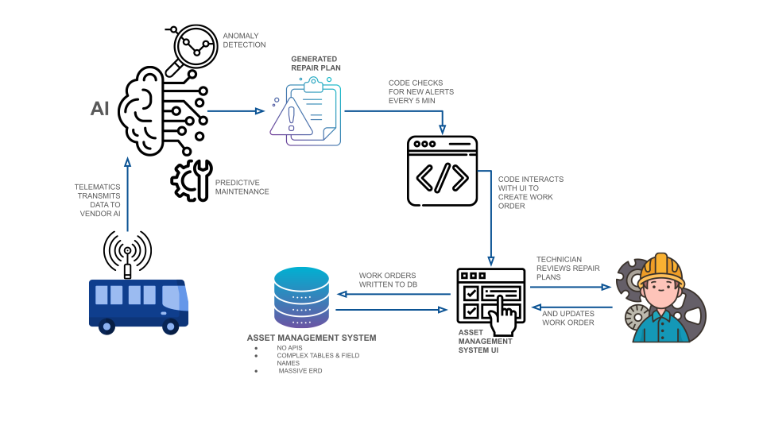

# About
This Python-based ETL pipeline is configured to execute at 5-minute intervals using the Windows Task Scheduler. Its primary function is to interface with vendor APIs, retrieving new alerts and vehicle repair plans in as close to real-time as possible. The pipeline is designed to integrate this data into the asset management system, enabling automated generation of planned work orders within the Enterprise Asset Management system.

# Key Features
- **Data Retrieval**: The pipeline actively polls vendor APIs for new alerts and vehicle repair plans, ensuring timely updates to the asset management system.
- **Automatic Data Entry**: Upon retrieval, the pipeline automatically enters the relevant data into the asset management system. This eliminates the need for manual data entry, reducing errors and improving efficiency. This also ensures that technicians are kept updated on the state of the vehicles.
- **Integration with the Enterprise Asset Management**: The pipeline facilitates the generation of planned work orders directly within the HxGN Enterprise Asset Management system, the main interface for technicians to access and review work orders and asset related data. This integration streamlines workflow processes and ensures a more seamless data transfer.
- **Utilization of vendor AI-generated Repair Plans**: The pipeline incorporates AI-generated repair plans from the vendor, enhancing the decision-making processes related to vehicle maintenance and asset management. This ensures proactive maintenance scheduling and optimized asset management.

Given limited access to the system database, a frontend-based solution was developed to interact with the asset management system. This approach enables the prototype to automate various asset management processes by directly transferring vendor data to the system or updating existing data.

Overall, this Python-based ETL pipeline offers a solution for automating asset management processes, enhancing efficiency, and exploring other opportunities to integrate other external data sources to the asset management systems such as odometer reading updates.

# Technology
| **Category**                | **Technologies**                                                                 |
|-----------------------------|---------------------------------------------------------------------------------------|
| **Programming & Data Processing** | Python                                                                          |
| **Data Integration**           | Vendor APIs, Enterpprise Asset Management System                         |
| **Automation & Scheduling**    | Windows Task Scheduler                                                            |
| **Data Entry & Interaction**   | UI-based interaction with the asset management system                        |
| **Data Retrieval**             | Vendor AI-generated API                                  |
| **Reporting & Updates**        | Automatic work order creation, integration with asset management systems           |
